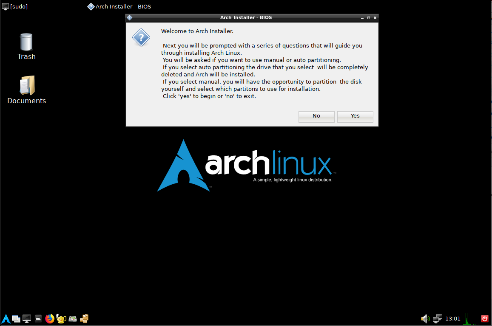

# Arch Live (Work In Progress)

A graphical Arch Linux live installer ISO image builder

Requires: [archiso](https://wiki.archlinux.org/index.php/archiso)

## Usage

Run `setup.sh` in a terminal with sudo or as root.

